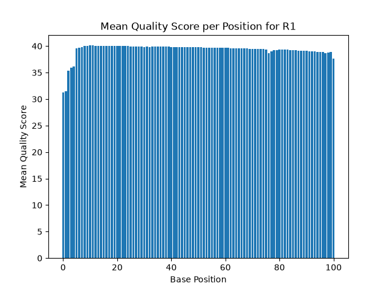
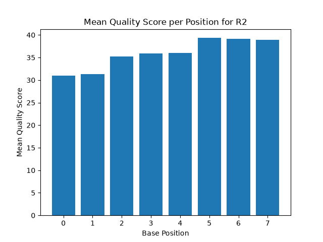
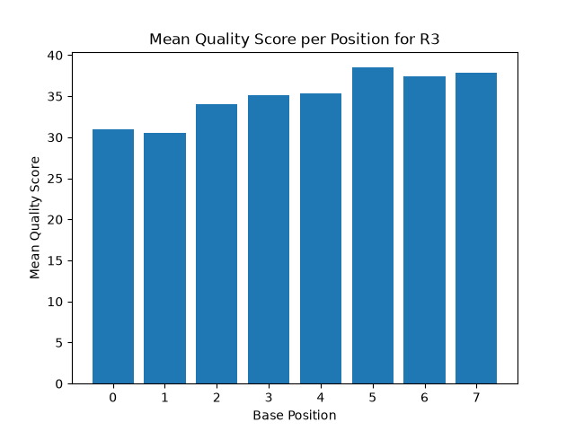
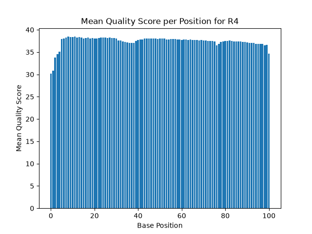

# Assignment the First

## Part 1
1. Be sure to upload your Python script. Provide a link to it here: [qual_dist.py](qual_dist.py)

| File name | label | Read length | Phred encoding |
|---|---|---|---|
| 1294_S1_L008_R1_001.fastq.gz | read1 | 101 | phred+33 |
| 1294_S1_L008_R2_001.fastq.gz | index1 | 8 | phred+33  |
| 1294_S1_L008_R3_001.fastq.gz | index2 | 8 | phred+33  |
| 1294_S1_L008_R4_001.fastq.gz | read2 | 101 | phred+33  |

2. Per-base NT distribution

    1. 
    
    
    
    


    2. 
    ```
     Honestly, a per-position mean quality cutoff isn't the metric I'd actually use here, especially as it means something different for the two read types. 

    For the index reads, I wouldn't use per-base quality distributions like this at all. The real question for an index isn't "how good is the average quality at each position," it's "does this 8bp index unambiguously identify one known sample." A one base change in an 8 nt length index is a bigger deal that one base change in a 101. There is more data in the longer read which can help offset a single error. However the change in the index is context dependent. If the change can make turn the error index into a valid other index, this is hugely significant as data could end up in the wrong index or sample and seem valid but not be and not throw an error. However if the change just produces a non valid index, it will end up in unknown, be discarded as data, and have little impact. So Hamming distance is the better tool for comparison here and making a cutoff: because the 24 indexes are designed to be well-separated, a change is not a big deal if it will just result in the sample being tossed. Also with a short index read it will be expected that the first few bases will be lower quality calls, built into the mechanism it just is with such a short sequence so again a score based cutoff seems the wrong idea. If forced to go this route I'd set a per-base cutoff of Q28. Since the low scores at the leading positions reflect the known startup sequencing reality, the reads are likely clustered near that value rather than widely spread, so a Q28 floor removes only true outliers without discarding otherwise-usable indexes (most likely to be clustered around the average shown around Q30 for the first 2 nt). That said, per-base quality is a blunt tool for indexes anyway, Hamming distance to the 24 known indexes is the better metric.

    For the biological reads, quality-based filtering matters even less for demultiplexing specifically, because demultiplexing is about sorting by index, not about the content of the biological read. Any real quality trimming of low-scoring positions would happen at a later step, before assembly or alignment, not during demultiplexing. If I were filtering biological reads at all here, it would maybe be to save downstream effort by discarding reads that are very bad overall, and I'd base that on the mean quality of an individual read (averaging across the bases of that one read), not on the per-position means shown in these plots. For that I'd use a lenient cutoff around Q20, since downstream tools tolerate some error and I don't want to throw away usable data this early.
    
    The one thing these per-position plots would actually be useful for is a uniform end-trim: if all reads showed quality dropping off past a certain position, I could trim every read at that point. In this data the quality stays high across the full read length with only a slight dip at the very ends, so no aggressive trimming that might apply bluntly to the whole data set seems relevant here.
    ```


    3. R2 or forward read barcodes, there are 3,976,613 that contain N's. R3 or reverse read barcode file contains 3,328,051 indexes that contain N's.
    
## Part 2
1. Define the problem:

There are four FASTQ files from one sequencing run: two with biological reads (R1, R4) and two with index reads (R2, R3). The reads are pooled together and need to be sorted back out by sample. Each read-pair has two indexes, and those indexes need to be checked against the 24 known indexes to determine whether they are a valid matched pair, two different known indexes (index hopping), or one/both unknown or too low quality to trust. Every read-pair gets sorted into the correct output file based on which of those three categories it falls into, so the data can be used for downstream analysis. The frequency and split of index hopping is also a problem worth investigating, so quantifying that is also part of the problem. 

2. Describe output: the output will take two forms, files and statistics.
```
output files: 52 in total
    names:
        index_read1 or index_read2 BUT ACTUALLY read 1 or read 2 (so from R1 or R4 source file) = 48 files
        hopped_R1 or hopped_R2 = 2 files
        unknown_R1 or unknown_R2 = 2 files
```
Statistics/Report generated to summarize the following:
* Total matched index reads (sum of all keys where the two indexs' are equal)
* Report various permutations of index hops and the number of times each happened. So indexA-indexB, indexA-indexC, and so on. 
* Total hopped (sum of all keys where the two indexs' differ)
* Total of the unknown count 
* Return/Report all of the above as a percentage of total read pairs (after counting the total of read pairs)

3. Upload your [4 input FASTQ files](../TEST-input_FASTQ) and your [>=6 expected output FASTQ files](../TEST-output_FASTQ).
4. Pseudocode
5. High level functions. For each function, be sure to include:
    1. Description/doc string
    2. Function headers (name and parameters)
    3. Test examples for individual functions
    4. Return statement
    ```
    def reverse_complement(seq: str) -> str:
    '''take a sequence of DNA and return the reverse complement of the strand'''
    complemented_bases = []              # empty list to collect each complemented base 
    for base in reversed(seq):      # through the the sequence backwards
        complement = DNAcomp_dict[base]  # look up this base's partner
        complemented_bases.append(complement)  # add it to the list
    revcomp = "".join(complemented_bases)  # glue the list into one string at the end
    return revcomp

    # Input: NCTTCGAC
    # Expected output: GTCGAAGN
    ```
